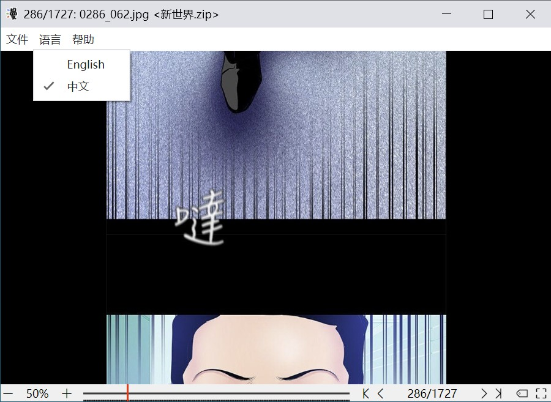

# iYo Webtoon Reader | 哎哟条漫阅读器 1.1.0

A simple local webtoon reader | 一个简单的本地条漫阅读器



[下载](https://github.com/ssnangua/iyo-webtoon-reader/releases) ([百度网盘](https://pan.baidu.com/s/104NeM6VPqeBJFMNoLP6fjA?pwd=0t2s))

## 特性介绍

一些网络漫画是长条状的（如韩漫），有时会把一个画面甚至对话框切成两张图片，网页浏览还好，但下载到本地看就很蛋疼了。

受此困扰，我写了这个阅读器，功能简单且纯粹，就是用来看本地条漫：

- 滚动自动加载，上下页无缝衔接
- 支持文件夹和 zip 压缩包（**压缩包只支持 zip 格式**）
- 压缩包使用块加载，大文件也能秒开
- 支持书签功能，可以标记章节、或者给关键剧情点添加标签
  - 书签会保存为当前漫画的同名 `.tags` 文件，放在漫画的同目录下，可分享给其他人

## 已知问题

压缩包内的 [utf8 文件名乱码](https://github.com/rubyzip/rubyzip/wiki/Files-with-non-ascii-filenames)，不影响使用。

## 开发

```bash
# 安装应用依赖
cd src
npm install
# 安装项目依赖
cd ..
npm install
# 开发
npm run dev
# 构建
npm run build
```

如果构建生成的 exe 文件图标在某些尺寸下不清晰，是构建工具 [nw-builder](https://nwutils.io/nw-builder/api-win.html#winrc-object) 的问题，可以用 [ResourceHacker](http://www.angusj.com/resourcehacker/) 手动替换下。

## 更新日志

- **1.1.0**
  - 增加书签面板
  - 支持设置滚动大小
  - 修复一些问题
